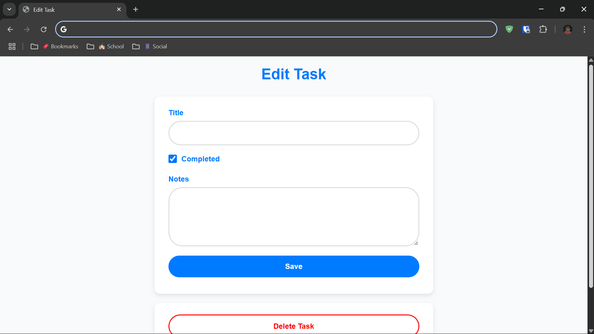

# To-Do List App

A clean and modern To-Do List web application built with Node.js, Express, and SQL. Users can create, edit, complete, add notes, and delete tasks. Designed with responsive layout and a light theme with blue accents.

---

## ✨ Features

- Add new tasks
- Edit tasks and add notes
- Mark tasks as completed or not completed
- Delete tasks
- Responsive design for mobile and desktop

---

## 📸 Screenshots




---

## 🚀 Getting Started

### 1. Clone the repository
```bash
git clone https://github.com/kajus-sir/todo-app
```
### 2. Navigate into the project folder
```bash
cd todo-app
```
### 3. Install dependencies
```bash
npm install
```
### 4. Start the server
```bash
node index.js
```
### 5. Open in your browser

Local Access:
Navigate to http://localhost:3000 in your web browser.

Access from Another Device (e.g., Phone):
Replace localhost with your device's IPv4 address. For example:
http://192.168.1.100:3000

---

## 🛠️ Built With
- Node.js
- Express
- EJS
- SQLite3
- HTML, CSS, JavaScript

---

## 📌 Future Improvements
- User authentication
- Task filtering (all / completed / pending)
- Due dates and reminders
- Dark mode theme

---

## 🗝️ License

This project is licensed under the [MIT License](./LICENSE).

---