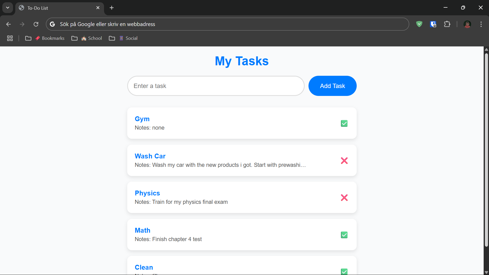

# To-Do List App

A clean and modern To-Do List web application built with Node.js, Express, and SQL. Users can create, edit, complete, add notes, and delete tasks. Designed with responsive layout and a light theme with blue accents.

---

## ✨ Features

- Add new tasks
- Edit tasks and add notes
- Mark tasks as completed or not completed
- Delete tasks
- Responsive design for mobile and desktop

---

## 📸 Screenshots




---

## 🚀 Getting Started
```bash
### 1. Clone the repository
git clone https://github.com/kajus-sir/todo-app

### 2. Navigate into the project folder
cd todo-app

### 3. Install dependencies
npm install

### 4. Start the server
node index.js
```
### 5. Open in your browser

Go to: http://localhost:3000

Or, if you want to open it from another device on the same network (like your phone), use your IPv4 address instead:
Example: http://192.168.1.5:3000

---

## 🛠️ Built With
- Node.js
- Express
- EJS
- SQLite3
- HTML, CSS, JavaScript

---

## 📌 Future Improvements
- User authentication
- Task filtering (all / completed / pending)
- Due dates and reminders
- Dark mode theme

---

## Other / Self-notes

Start server - node index.js

Open Database in Sqlite3
 - sqlite3 todo.db
 - PRAGMA table_info(tasks);

Check Your Changes
    SELECT * FROM lists; - Shows list
 
Add a New Task
    INSERT INTO tasks (task_name, status) VALUES ('Buy groceries', 0);

Edit an Existing Task
    UPDATE tasks SET completed = 1 WHERE title = 'Do homework';

Remove a Task
    DELETE FROM tasks WHERE id = 4;

Add Changes to Repo
    git status
    git add .
    git commit -m "Your commit-message here"
    git push origin main


